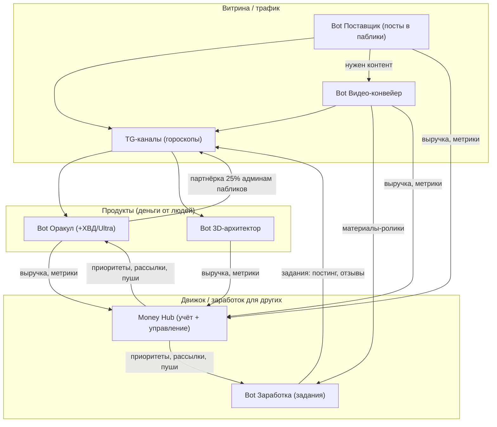

# Экосистема проектов M — как всё усиливает друг друга и продаётся другим

Дата: 2026-07-02. Автор набросков — владелец; здесь они структурированы, дополнены и
связаны в единый контур. Дополняет `PROJECTS_STRUCTURE.md` (технический срез) — этот
документ про **бизнес-логику, монетизацию и связки**.

Главная идея: не 6 отдельных ботов, а **один замкнутый контур**, где каждый проект
кормит остальных трафиком, контентом, деньгами и рабочими руками. И каждый проект
можно **отдать другому человеку под ключ** (white-label / партнёрка) и зарабатывать с
его оборота.

---

## Карта контура

Три слоя:
1. **Витрина** гонит бесплатный трафик (каналы, видео, автопостинг в чужие паблики).
2. **Продукты** превращают трафик в деньги (Оракул с ХВД/Ultra, 3D-архитектор).
3. **Движок** даёт заработать другим (задания) и сводит всё в учёте (Money Hub).

Каждая стрелка — реальный канал усиления, не абстракция. Ниже — по каждому проекту:
что делает, тарифы, для кого, что уже готово в коде, чего не хватает.

---

## 1. Bot Оракул (@MOracul_bot) — ядро выручки с людей

**Что делает:** контент для самопознания и помощи (таро, гороскоп, натальная, ХВД,
Ultra Plus «Книга о тебе»), подписка и разовые премиум-продукты, вирусный рост через
приглашение друзей.

| Оффер | Цена | Статус |
|---|---|---|
| Бесплатно | 2 расклада/день + «приведи друга» | ✅ работает |
| Премиум безлимит | 299₽/мес | ✅ работает |
| Безлимит за друзей | 10 приглашённых активных = безлимит | ✅ работает |
| ХВД (разбор личности) | 599₽ | ✅ работает |
| Ultra Plus «Книга о тебе» | 1499₽ | ✅ работает |
| PDF-довыгрузка | +200₽ (ХВД) / +99₽ (разбор) | ✅ работает |

**Связки с контуром:**
- **Каналы → Оракул:** посты с UTM-метками `src_` гонят трафик, атрибуция в `/sources`.
- **Оракул → Каналы (партнёрка):** админам пабликов — **25% с оплат** их аудитории.
  Это ключ к бесплатному масштабированию: чужие паблики приводят платящих.
- **Оракул → Money Hub:** вся выручка и воронка стекаются в учёт.

**Что уже сделано в этой сессии:** воронка отработки возражений (час не купил →
вопрос → −50% → даунсейл → Премиум), рассылка книг с пропуском купивших, прогноз и
вечерний отчёт продаж админу, конкретные годы жизни в ХВД.

**Чего не хватает:** партнёрский кабинет для админов пабликов (выплата 25%
автоматически), A/B-тест цен, дожим «открыл, но не купил» повторным показом.

---

## 2. Bot Заработка (@M_onetest_bot) — «движок» для других людей

**Что делает:** даёт людям зарабатывать на заданиях. Две стороны рынка:

| Для исполнителя | Для рекламодателя (заказчика) |
|---|---|
| Партнёрки (CPA): Яндекс, Ozon, банки, ОСАГО | Разместить задание: постинг, отзывы, охваты |
| Просмотр видео / прослушивание аудио | Купить охваты у сети исполнителей |
| Просмотр рекламы, задания в соцсетях | Оплата за результат (proof + антифрод) |
| Вывод от 5000₽ на СБП | Прозрачная статистика выполнения |

**Связки:**
- **Видео-конвейер → Заработок:** готовые ролики становятся материалами для заданий
  «выложи на свой аккаунт».
- **Заработок → Каналы/Оракул:** задания «запостить оффер Оракула» = дешёвый трафик
  руками исполнителей.
- **Заработок → Money Hub:** учёт заданий, выплат, маржи.

**Чего не хватает:** снять `coming_soon` с TikTok/VK/Avito-заданий, автовыплаты, KYC,
наполнить каталог живых заданий (сейчас часть — заглушки).

---

## 3. Bot 3D-архитектор (@MoRoZovGPTchat_bot) — продукт с высоким чеком

**Что делает:** фото/запрос → 3D-модель под печать (STL/3MF), карточки для Avito.

| Тариф | Цена |
|---|---|
| Бесплатно | 1 модель/день (без учёта корректировок) |
| 1 модель (с корректировками) | 49₽ |
| Пакет 10 моделей | 450₽ |
| Пакет 100 моделей | 3500₽ |

**Для кого:** у кого есть 3D-принтер (хобби, мелкое производство, мастерские).
**Каналы:** сайт + ТГ-бот.

**Связки:**
- **3D → Avito:** готовые карточки товара → продажи напечатанного.
- **3D → Заработок:** «3D-модель на заказ» как задание/услуга.
- **3D → Money Hub:** выручка и загрузка воркера.

**Чего не хватает:** облачный рендер 24/7 (сейчас тяжёлый локальный/Mac worker),
оплата Stars/ЮKassa прямо в боте, публичная витрина готовых моделей.

---

## 4. Bot Видео-конвейер (@M_twotest_bot) — фабрика контента + отдельный продукт

**Что делает:** генерит вертикальные ролики 9:16 (B-roll, кинетичные субтитры,
озвучка) пачками и постит их. Работает и на себя (контент для каналов Оракула), и как
**платный сервис для клиентов**.

**Что нужно достроить (из наброска):**
- **Сайт:** личный кабинет, клиент даёт доступы к своим аккаунтам для автопостинга.
- **ТГ-бот:** статистика и задания, управление «что и когда».
- **Настройка:** авто и ручная — клиент задаёт кол-во постов, темы, длительность,
  период; по умолчанию авто, можно переключить на ручную.

| Тариф | Условие |
|---|---|
| Бесплатный | 1 видео/день в течение недели, дальше только платно |
| Пробная неделя | 14 видео (утро/вечер) или смена 14 дней по 1 |
| Месяц | 60 видео, каждый день 2 раза — **8999₽** |

**Для кого:** все, кому нужны видео + автопостинг либо скачивание (блогеры, локальный
бизнес, SMM-агентства).

**Связки:**
- **Видео → Каналы Оракула:** бесплатный контент для прогрева.
- **Видео → Заработок:** ролики как материалы для заданий.
- **Видео → Поставщик:** Поставщику нужен контент — видео-конвейер его поставляет.

**Что уже готово в коде:** batch-рендер, озвучка, субтитры, распределение по площадкам
(Telegram — live; YouTube/VK/TikTok — код есть, нужны ключи/OAuth). Сегодня починил
эмодзи-квадраты в титрах, отрендерил 2 ролика.

**Чего не хватает:** сайт с ЛК и приёмом доступов к аккаунтам, биллинг тарифов,
OAuth YouTube + токен VK + одобренное TikTok-приложение.

---

## 5. Bot Поставщик — автопостинг в ЧУЖИЕ паблики (новый, самый B2B)

**Что делает:** админ добавляет бота в свой паблик → бот сам делает посты в тему
канала и рекламу. Это SaaS для владельцев каналов.

**Механика (из наброска):**
- **Сайт с ЛК:** клиент вводит свой ТГ-канал, добавляет бота админом, жмёт OK.
  На странице обновляется статус «бот подключён». У каждой кнопки — подсказка, что
  делать. Кнопки: «Статистика» и «Посты».
- **Бот изучает** контент и тематику канала → настраивает кол-во постов/день, время,
  период. Два режима: авто (по умолчанию) и ручной.
- **Управление:** выбор типа контента (текст, видео, статьи), добавление своих
  новостей/рекламы. ТГ-бот для статистики и управления; регистрация на сайте →
  привязка аккаунта.
- **Статистика и отчёты:** история вышедших постов, просмотры/репосты/лайки, динамика
  и оценка эффективности (почему зашло / не зашло), сравнение неделя-к-неделе
  (свои посты vs. бота — чтобы понимать, что интереснее аудитории).

| Тариф | Цена |
|---|---|
| 1-я неделя (новый клиент) | Бесплатно |
| Неделя | 299₽ |
| 2 недели | 499₽ |
| Месяц | 700₽ |

**Защита:** от повторных аккаунтов (уже подключённый канал нельзя снова взять на
бесплатный тариф); регистрация только через русскую почту / ВК / номер телефона.

**Для меня (владельца):** рассылка по всем клиентам куда угодно (сайт, их бот, СМС),
статистика сколько людей и кто; авто-рассылка с пушами по воронке «подключи платный
режим» — зачем, почему, выгоды, призыв к действию (та же механика возражений, что уже
built в Оракуле — переиспользуем).

**Связки:**
- **Поставщик ← Видео-конвейер:** источник контента для постов.
- **Поставщик → Оракул/Заработок:** в чужие паблики можно вшивать и свои офферы.
- **Поставщик → Money Hub:** новый поток B2B-выручки (700₽/мес × число каналов).

**Статус:** пока набросок. Ближе всего к реализации через существующий
`channel_queue` Оракула (движок постинга по расписанию уже есть) + логику подписок из
Оракула. Самый быстрый способ запустить — переиспользовать эти два модуля.

---

## 6. Money Hub — учёт, приоритеты, пульт управления

**Что делает:** единая точка «сколько заработал / что делать дальше». План-факт по ₽,
реестр идей, 12 сфер жизни, метрики ботов, рассылки, Avito-генератор.

**Связки:** принимает выручку и метрики со всех ботов, отдаёт приоритеты и запускает
рассылки/пуши. Это «мозг», а не отдельный продукт на продажу.

**Чего не хватает:** постоянная БД на проде (сейчас риск потери на free Render),
единый биллинг всех продуктов, дашборд воронки возражений и продаж книг.

---

## 7. Avito — монетизация «на земле»

**Что делает:** генератор объявлений (услуги экосистемы) + карточки товаров из 3D-бота.
Ранее был отдельный проект по созданию и заливу объявлений на Avito — его стоит
восстановить как отдельный канал сбыта (напечатанные 3D-модели, услуги видео/постинга).

**Чего не хватает:** нет API Avito (публикация ручная) → нужна CRM лидов и связка с
Avito-заданиями в боте Заработка (исполнители льют объявления руками).

---

## Модель «отдать другому и зарабатывать с него»

Каждый продукт — это ещё и **franchise/white-label**:

| Продукт | Что отдаём партнёру | Наш заработок |
|---|---|---|
| Оракул | Партнёрство админам пабликов | 25% с оплат их аудитории |
| Поставщик | SaaS-подписка на автопостинг | 299–700₽/мес с канала |
| Видео-конвейер | Подписка на генерацию | до 8999₽/мес с клиента |
| 3D-архитектор | Пакеты моделей | 49–3500₽ с заказа |
| Заработок | Двусторонний рынок | комиссия с оборота заданий |

Общий принцип: **бесплатный вход → ценность → платный режим через воронку с
отработкой возражений** (механика уже реализована в Оракуле, переиспользуется везде).

---

## Что усиливает что (петли роста)

1. **Контент-петля:** Видео-конвейер → каналы/Поставщик → трафик в Оракул → выручка →
   бюджет на ещё больше контента.
2. **Партнёрская петля:** Оракул платит 25% админам пабликов → они постят Оракул →
   больше платящих → больше партнёров.
3. **Трудовая петля:** Заработок раздаёт задания «постить офферы» → дешёвый трафик во
   все продукты, руки для Avito и постинга.
4. **Данные-петля:** Money Hub видит, что продаётся → приоритизирует контент и офферы →
   растит конверсию.

---

## Приоритетный роадмап (что делать по порядку)

**Сейчас (в работе / готово):**
- [x] Оракул: воронка возражений, рассылка книг, прогноз + вечерний отчёт продаж.
- [x] Видео-конвейер: фикс титров, рендер роликов.

**Ближайшее (высокий эффект, малый труд — переиспользуем готовое):**
- [ ] Партнёрский кабинет админов пабликов (выплата 25%) — растит трафик Оракула даром.
- [ ] Bot Поставщик MVP на базе `channel_queue` + подписки Оракула (быстрый B2B-доход).
- [ ] Снять `coming_soon` с TikTok/VK-заданий в боте Заработка + автопостинг видео.

**Средний срок:**
- [ ] Сайт-ЛК для Видео-конвейера и Поставщика (приём доступов, биллинг тарифов).
- [ ] Единый биллинг и постоянная БД в Money Hub (уйти с ephemeral-диска).
- [ ] Облачный рендер 3D 24/7 + оплата в боте.

**Позже:**
- [ ] Восстановить Avito-залив как отдельный канал сбыта + CRM лидов.
- [ ] Дашборд воронки возражений и продаж книг в Money Hub.

---

## Открытые вопросы к владельцу (для точной приоритизации)

1. Что раньше запускаем как новый B2B-доход — **Поставщик** (SaaS-подписка на паблики)
   или добить **Видео-конвейер** до платного сервиса с сайтом?
2. Партнёрка 25% для админов пабликов — делаем автоматический кабинет или сначала
   вручную договориться с 3–5 пабликами и мерить конверсию?
3. Avito — восстанавливаем старый проект залива или пока хватит ручной публикации
   через генератор карточек?
